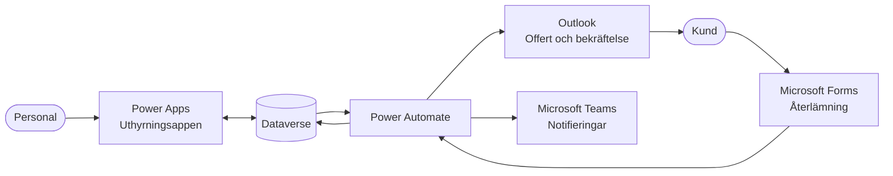
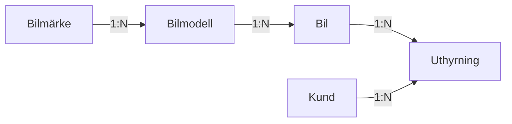
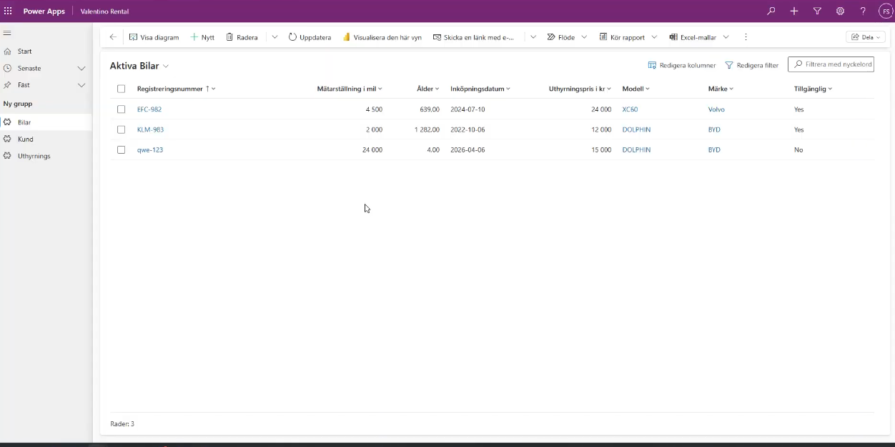
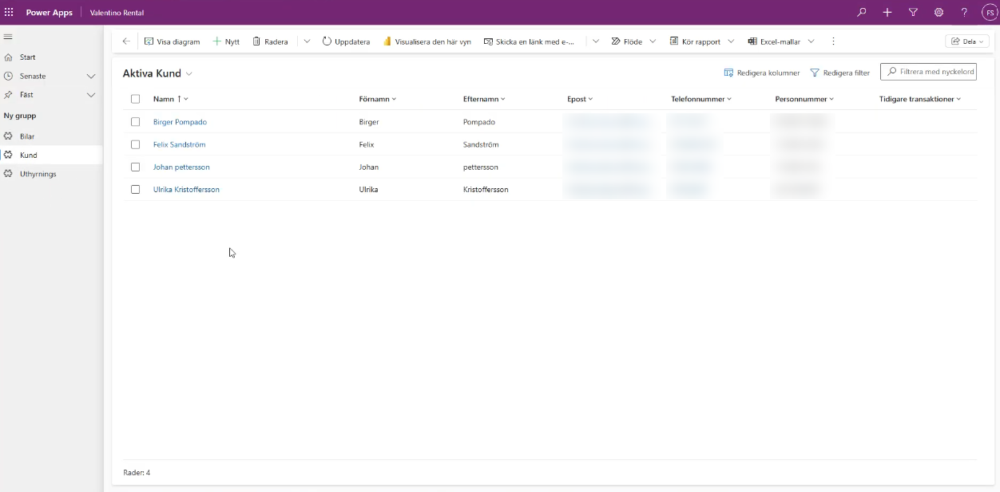
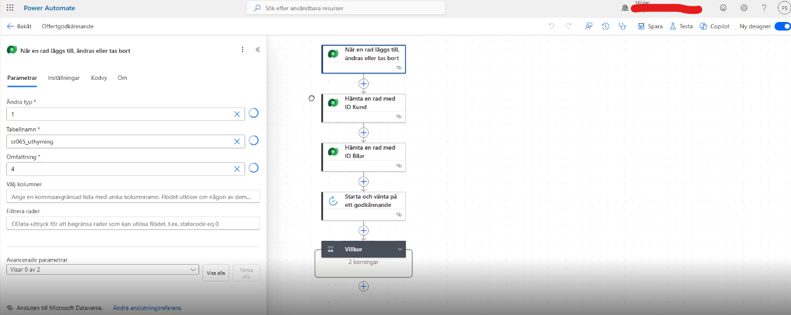
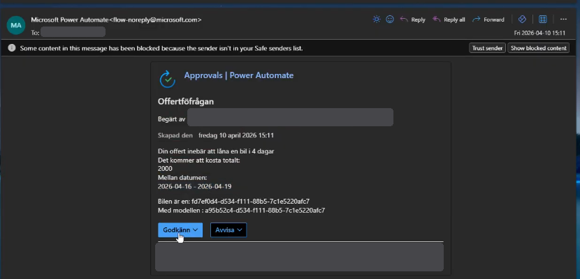
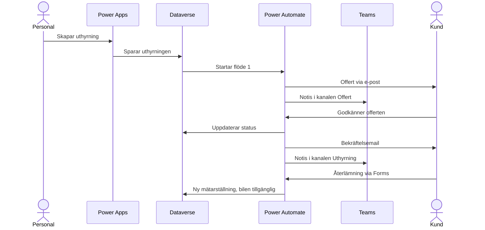

# Valentino Rental – offert- och ordersystem för biluthyrning

Ett system för biluthyrning byggt i Microsoft Power Platform. Personalen registrerar bilar, kunder och uthyrningar i en app, och systemet sköter sedan offert, godkännande, bekräftelse och återlämning automatiskt, med notifieringar direkt i Teams.

> Skolprojekt inom utbildningen Moln- och virtualiseringsspecialist, Campus Mölndal.

**Teknik:** Power Apps · Power Automate · Dataverse · Microsoft Teams · Microsoft Forms · Outlook

---

## Översikt

| Komponent | Roll i systemet |
|---|---|
| **Dataverse** | Central databas för bilar, kunder och uthyrningar |
| **Power Apps** | Appen som personalen arbetar i |
| **Power Automate** | Affärslogiken: offert, godkännande och återlämning |
| **Microsoft Teams** | Kommunikation och notifieringar till personalen |
| **Microsoft Forms** | Formulär för återlämning av bil |

## Arkitektur

## Datamodell

| Tabell | Kolumner |
|---|---|
| **Bil** | Registreringsnummer (primär), Bilmärke (lookup), Bilmodell (lookup), Mätarställning, Inköpsdatum, Ålder (beräknad), Uthyrningspris, Status |
| **Kund** | Namn (primär), Förnamn, Efternamn, E-post, Telefonnummer, Personnummer |
| **Uthyrning** | Uthyrnings-ID (primär), Kund (lookup), Bil (lookup), Startdatum, Slutdatum, Antal dagar (beräknad), Pris per dag, Totalpris (beräknad), Offertstatus |
| **Bilmärke** | Märke |
| **Bilmodell** | Modell, koppling till Bilmärke |

### Affärslogik

| Fält | Logik |
|---|---|
| Antal dagar | `DateDiff(Startdatum; DateAdd(Slutdatum; 1; TimeUnit.Days))` |
| Totalpris | `'Dagspris i KR' * 'Antal dagar'` |
| Kundnamn | Förnamn + Efternamn |
| Bilens ålder | `DateDiff(Inköpsdatum; UTCToday())` |

Antal dagar räknar med både start- och slutdatum, därför läggs en dag till. Formlerna använder semikolon som avgränsare, eftersom miljön har svenska språkinställningar.

## Power Apps – Uthyrningsappen

- Hantera bilar: skapa, visa, uppdatera och ta bort
- Hantera kunder, med kundens uthyrningshistorik i en subgrid
- Hantera uthyrningar, med automatisk beräkning av antal dagar och totalpris
- Quick View som visar bilinformation direkt i uthyrningsformuläret
- Appen är inlagd som flik i Teams

*Bilar med mätarställning, beräknad ålder, pris, modell, märke och tillgänglighet.*

*Kundregistret. Kontaktuppgifter och personnummer är dolda.*

## Power Automate

### Flöde 1 – Skapa offert
**Trigger:** en ny uthyrning skapas i Dataverse

1. Hämtar kund och bil
2. Skickar offert till kunden via e-post
3. Startar ett godkännande (Approval)
4. Skickar meddelande till kanalen *Offert* i Teams

*Flödet startar när en uthyrning skapas, hämtar kund och bil, och väntar sedan på godkännande.*

*Offerten som mottagaren får, med knappar för att godkänna eller avvisa.*

### Flöde 2 – Godkännande
**Trigger:** svar på godkännandet

Vid godkännande:
1. Uppdaterar offertstatus
2. Skickar bekräftelsemail
3. Skickar meddelande till kanalen *Uthyrning* i Teams
4. Uppdaterar bilens status

### Flöde 3 – Återlämning
**Trigger:** nytt svar i återlämningsformuläret i Forms

1. Identifierar bilen via registreringsnumret
2. Uppdaterar mätarställningen
3. Sätter bilen som tillgänglig

## Microsoft Teams

Team: **Valentino Rental**

| Kanal | Typ |
|---|---|
| Offert | Standard |
| Uthyrning | Standard |
| Ledning | Privat |
| Support | Standard |

Kanalerna *Offert* och *Uthyrning* tar emot automatiska notiser från Power Automate.

## Microsoft Forms

Formulär för återlämning av bil med fälten **Registreringsnummer** och **Mätarställning**. Varje svar startar flöde 3.

## Informationsflöde

## Begränsningar och vidareutveckling

**Begränsningar**
- Godkännandeflödet kräver en mottagare som kan ta emot Approvals
- Det finns ingen extern kundportal

**Möjlig vidareutveckling**
- Fakturering
- Integration med betalning
- Dashboard i Power BI
- Visa bilens registreringsnummer och modellnamn i offertmailet i stället för ID

## Vad jag lärde mig

<!-- Skriv 3–5 meningar med egna ord. Frågor att utgå från:
     Vad var nytt för dig? Vad var svårast, och hur löste du det?
     Vad skulle du göra annorlunda nästa gång? -->

[Skriv dina egna reflektioner här.]
